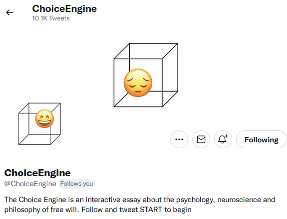

# The Choice Engine

Choice Engine was a twitter bot which you could send messages to, in the style of a Choose Your Own Adventure / text-adventure, exploring an branching essay about the neuroscience, psychology and philosophy of freewill. 

Originally, you engaged with the project by following @ChoiceEngine on twitter and tweeting at it [START](https://twitter.com/intent/tweet?text=@ChoiceEngine%20START), before November 2022. Now you can use the table of contents below to read the essay text directly 

You may also like

* the account at twitter.com [@choiceengine](https://twitter.com/ChoiceEngine)
* An article about Choice Engine in New Scientist: ['The idea that we lack free will is built upon a mistaken sense of what it means to be a biological machine, argues psychologist Tom Stafford'](https://www.sciencedirect.com/science/article/pii/S0262407919306037)
* 2018-09-03: [The blog post at mindhacks.com](https://mindhacks.com/2018/09/13/the-choice-engine/)

&#9744; &#9744;

# Complete table of contents

You can follow the map at the bottom to work out a route through the text, or read it in the order below (which is arbitrary). If you are navigating using the bot to fetch text and aren't seeing replies, you may have need this page: [teething](teething)

1: [dark-wood](dark-wood) - START HERE

2: [have-map](have-map)

3: [philosophers](philosophers)

4: [useless](useless)

5: [determinism](determinism)

6: [libet1](libet1)

7: [libet2](libet2)

8: [sphexishness](sphexishness)

9: [complexity](complexity)

10: [chaos](chaos)

11: [reasons](reasons)

12: [intuitions](intuitions)

13: [causation](causation)

14: [expts](expts)

15: [hyped](hyped)

16: [close](close)

17: [more](more)

18: [colophon](colophon)

# Map

&#9744; &#9744;

Donate: if you enjoyed this project, you can donate via PayPal [here](paypal.me/tomqstafford). Proceeds will be split between the design team, who did far more work than they were paid for, with Tom's 1/3rd going to [City of Sanctuary](https://cityofsanctuary.org/), an organisation working to build a culture of hospitality for people seeking sanctuary in the UK 

&#9744; &#9744;

This project started as notes on a talk, "Free will, Neuroscience and the Power of Reason" given to the [University of Sheffield Secular & Atheist Society](https://www.facebook.com/events/618961544893961) 11 December 2014.

Thanks to Henry Cooke ([@prehensile](https://twitter.com/prehensile)) for advice on bots, Leila Johnston ([@WhosTheSuit](https://twitter.com/WhosTheSuit)), and to those I've talked with about these issues over the years (but who do not necessarily endorse the ideas in this essay), especially Nicol Harper and Laurence Piercy.

&#9744; &#9744;

