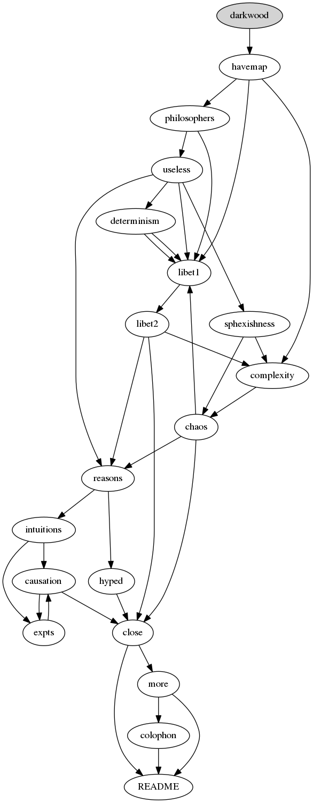

# Contents

You can follow the map at the bottom, or read in this rough order. If you aren't seeing replies, you may have need this page: [teething](teething)

1: [dark-wood](dark-wood) - START HERE

2: [have-map](have-map)

3: [philosophers](philosophers)

4: [useless](useless)

5: [determinism](determinism)

6: [libet1](libet1)

7: [libet2](libet2)

8: [sphexishness](sphexishness)

9: [complexity](complexity)

10: [chaos](chaos)

11: [reasons](reasons)

12: [intuitions](intuitions)

13: [causation](causation)

14: [expts](expts)

15: [hyped](hyped)

16: [close](close)

17: [more](more)

18: [colophon](colophon)

