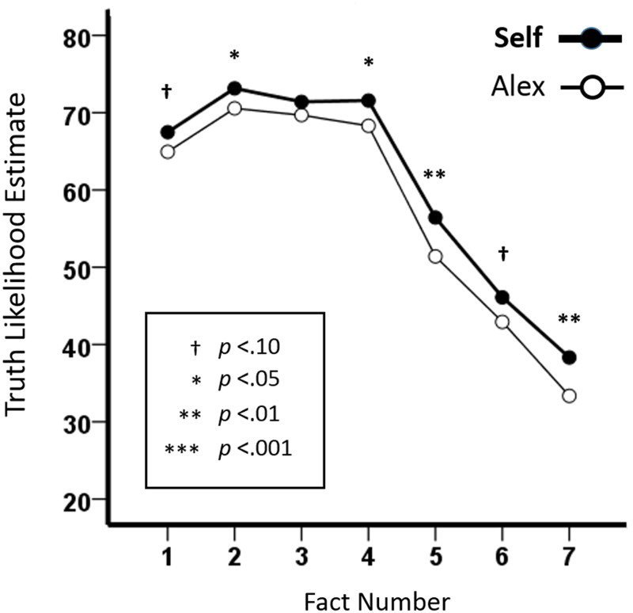

# Our irrationality is over-hyped

There's a market for our irrationality. Psychologists make money by trumpeting our cognitive foibles. Go to the book shop and you can buy "[You are not so smart](https://youarenotsosmart.com/author/davidmcraney/)" by David McRaney, or read Cordelia Fine on "[How our brain distorts and deceives](https://www.goodreads.com/book/show/357666.A_Mind_of_Its_Own)", or Dan Ariely who will tell you that we are "[Predictably Irrational](https://en.wikipedia.org/wiki/Predictably_Irrational)". And dozens of others. The authors are smart, honest, people, but it isn't a coincidence that so many books on the mind choose to portray human thought as basically untrustworthy or insane.

We could have fun speculating why this is - do we want to be told we're not rational, so as to avoid responsibility? Or is there some more sinister force which benefits if we believe this? Or is it just a convenient story which is more interesting than "the mind does a good job most of the time"? Whatever the reasons, there is a pervasive bias to interpret psychology research as showing our irrationality when often it shows precisely the reverse.

Here's a simple example from a recent paper published in the Quarterly Journal of Experimental Psychology (yes, I am a subscriber).

Aiden Gregg and colleagues published '[The SPOT effect: People spontaneously prefer their own theories](https://www.tandfonline.com/doi/full/10.1080/17470218.2015.1099162)' in 2017. They were interested in how people respond to evidence. To do this they told participants about an alien world, and evidence gathered from this imaginary world about two species on it. After presenting each piece of evidence they asked people to rate how true a theory about how these species interacted was likely to be. Their experiments involved manipulating if the theory they rated was described as "your theory" or if it was ascribed to a researcher called Alex.

Even though participants didn't come up with the theory they were rating, telling them they were rating their own theory had a clear effect. Compared to people who rated a theory described as someone else's (or nobody's), people who rated a theory which was described as their own said it was more likely to be true, even when the evidence came along suggesting it probably wasn't true.

So far, so unsurprising to anyone who has heard of confirmation bias[1](#footnote1). But I'm telling you about this because this research on bias, which truly does provide evidence of bias in how we evaluate evidence, also shows how reasonable and rational typical people are. 

Look at this graph of the results from the experiment:

This is a great example of the figure-ground effect in the literature on bias-rationality. Yes, the confirmation bias effect is real but look at the size of the bias (black vs white line) compared to influence of evidence (x-axis).

Facts number 5, 6 and 7 are the ones which suggested the theory wasn't true. So these points mark when people start to see disconfirmatory evidence. The experiments show that people respond *massively* to new evidence.

What is happening is that people are biased to prefer a theory they think of as theirs (this is the difference between the white and black lines), but they also adjust their beliefs according to the evidence they are given (this is the change in the shape of the lines, as more facts are delivered).

The research shows that people are both biased *and* evidence sensitive, but only one of those conclusions is worth mentioning in psychology. 

Time and time again a psychology experiment which shows evidence of reasonableness and bias is promoted as evidence of our irrationality. As a wider trend, this is profoundly corrosive to how we think about ourselves.

&#9744; &#9744;

Where this all takes us, tweet @ChoiceEngine [CLOSE](https://twitter.com/intent/tweet?text=@ChoiceEngine%20CLOSE)

&#9744; &#9744;

<a name="footnote1">1</a>: And once you learn about confirmation bias you start to see it everywhere.

<a name="footnote2">2</a>: This is experiment 3, figure 3 in original paper, but all three experiments gave similar results.
