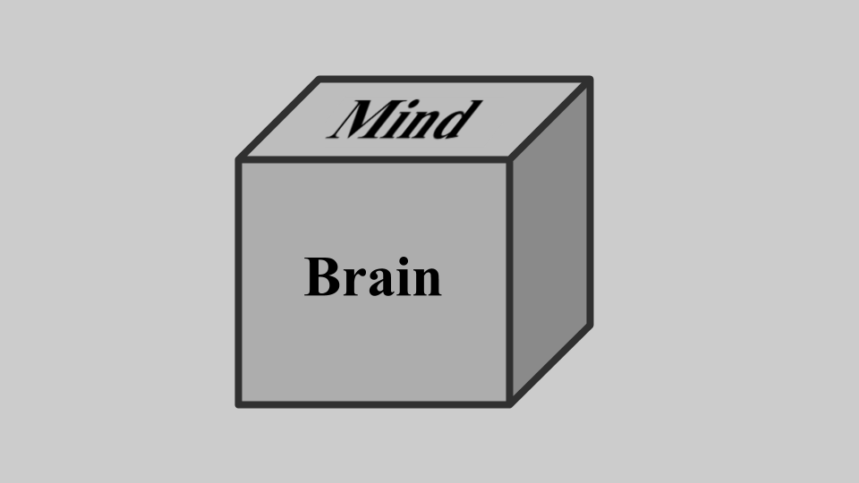

# Intuitions

Did I convince you that simple rules can lead to the endless, generation of unpredictable forms? This is why I don't think determinism is any threat to our free choice.

Our choices are free because they are ours, not because they are independent of the rest of the universe. They arise from the bit of the universe which we occupy - *our* history, *our* brains, *our* thoughts. This is what makes them unique, personal, unpredictable. 

And yet. 

And yet.

Even though I avow this, it doesn't alwats sit comfortably. Maybe you're the same. My intuitions tell me that the riddle isn't solved. 

Part of this is how deeply felt is our natural born dualism[1](#footnote1). We feel like our minds are not just different from our brains, but a different kind of stuff. Non-physical thought stuff, existing in a different realm from [the meat of our bodies and brains](https://mindhacks.com/2011/07/07/theyre-made-out-of-meat/).

I think if you tried to make a diagram of how people naturally thought about the mind and brain it would be something like this:

The brain and mind as two entities, and the brain influencing the mind but not the other way around. 

But this isn't true. A better image is this one:

Mind and Brain are different sides of the same thing, just like a bicycle has wheels but it can also have a speed and direction. These are properties and functions, both intimately related to each other, existing intertwined but different kinds of things[2](#footnote2).

When something affects your mind your brain is changed. Thoughts and feelings, arguments and reasons, all have a physical reality in your brain meat. We only have the slenderest grasp of what this reality is, but we know that events in the space of meaning - reasons, imaginations, fears and hopes are as causally real as events in physical space.

&#9744; &#9744;

What happens when you tell people they are, or they aren't free: [EXPTS](https://twitter.com/intent/tweet?text=@ChoiceEngine%20EXPTS); direct link [expts](expts)

Why it matters how you think of the mind/brain [CAUSATION](https://twitter.com/intent/tweet?text=@ChoiceEngine%20CAUSATION); direct link [causation](causation)

&#9744; &#9744;

<a name="footnote1">1</a>: Paul Bloom's book is "[Descartes' Baby: How the Science of Child Development Explains What Makes Us Human ](https://www.goodreads.com/book/show/225880.Descartes_Baby)" is great on the idea that we are 'Natural Born Dualists'

<a name="footnote2">2</a>: Maybe this view of things is more common that I thought: here's Christian Jarrett summarising research which found that [Neuroscience does not threaten people’s sense of free will](https://digest.bps.org.uk/2014/09/23/neuroscience-does-not-threaten-peoples-sense-of-free-will/)
